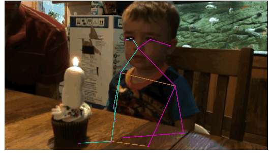
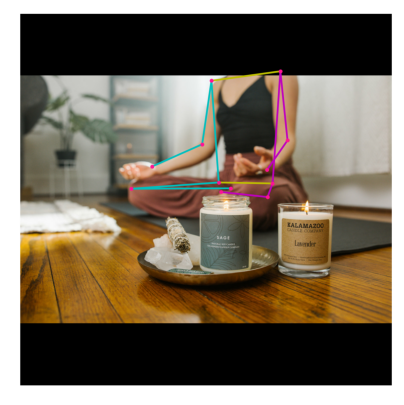

# Mathematics of Data Science Fall '23

#### Ava Bender

## Data Deck Slides

[Data slides](https://docs.google.com/presentation/d/1haspTDMDRBqYV1HqobesPBlry8xl7h2aeaOQMy7J5P0/edit#slide=id.g1e5fe554c45_0_175)

## App Demo

[Coin Flipper](https://abender2022.github.io/Data_Website/cointoss.html)

[Calender](https://abender2022.github.io/Data_Website/calender.html)

[To Do List](https://abender2022.github.io/Data_Website/ToDoList.html)

[Random Picker](https://abender2022.github.io/Data_Website/Randpicker.html)

[Countdown Timer](https://abender2022.github.io/Data_Website/countdown.html)

[Dice Roller](https://abender2022.github.io/Data_Website/Dice.html)

[Trash Night](https://abender2022.github.io/Data_Website/trashnight.html)

## My App Demos

[Jump Game](https://abender2022.github.io/Data_Website/jump.html)

[Stranger Things Quiz](https://abender2022.github.io/Data_Website/STGame.html)

## My Website

[Ava's Website](https://abender2022.github.io/Data_Website/index.html)

## Notebooks

[Recipe Book](https://colab.research.google.com/drive/1u8j-W_AFuglqqJQtI6T3KohwK8-1hf4h?usp=sharing)

[Notebook1](https://colab.research.google.com/drive/1jTwaVjYUuwJ2SG0snIc25zsO82BZZUpg?usp=sharing)

[Ava Data Images Intro Load Slides](https://colab.research.google.com/drive/1MIozHHBE-MU3d4H6ef08YUZWMiPRDUZ2?usp=sharing)

[Matrix Vector Notes](https://colab.research.google.com/drive/1J9-YxZhu84OWo7jQGtaxj-9-S05dN-2Q?usp=sharing)

[Ava Data Science 2023 MNIST](https://colab.research.google.com/drive/1K92t60sFLLO_NutmmrRgXVnC2oES7ZND?usp=sharing)

[ALexnet](https://colab.research.google.com/drive/1A6onnNo79Ezu45zcUMt-c-JicDEwSeBl?usp=sharing)

[Covolution](https://colab.research.google.com/drive/183OEMpSxA4ZRZAnXW28HmRaht_OC1maC?usp=sharing)

[Webcam](https://colab.research.google.com/drive/1c5aPuP6qyX30_AQKjl0ILoU4nNhDRiUF?usp=sharing)

[Flowers 102](https://colab.research.google.com/drive/1mFvs_XDLI06dZC26fb1EjPN7KKgWagXQ?usp=sharing)

[Custom Data Filter](https://colab.research.google.com/drive/1t97HXnuHNHHOeTKADFFIA5ycf-JCHq4Z?usp=sharing)

[Pose Machine](https://colab.research.google.com/drive/1BZBGKpceLqz5gi9phE3OnYrBJQWjCTcZ?usp=sharing)

[SAM](https://colab.research.google.com/drive/1Uqh_48-YqvHL_FQPvwSrRHcrT9lIFpD_?usp=sharing)

[YOLOv5](https://colab.research.google.com/drive/1utObeYZqo2e-ZSKry0Pu--1R1iXspulW?usp=sharing)

[Alexnet Candles](https://colab.research.google.com/drive/1k2DbZNns2Mcn0VL2yIxZh8zxRvDX_w6M?usp=sharing)

[Alexnet 2](https://colab.research.google.com/drive/1HjevEJdxMKBQnBqfdU7aS9RLc_boNzcJ?usp=sharing)

## Links

[metaheuristics](https://en.wikipedia.org/wiki/List_of_metaphor-based_metaheuristics)

[Image Kernals](https://setosa.io/ev/image-kernels/#:~:text=An%20image%20kernel%20is%20a,important%20portions%20of%20an%20image.)

[Deap Learning Visual Toolbox](https://www.youtube.com/watch?v=AgkfIQ4IGaM)

[Computer Literacy Project](https://clp.bbcrewind.co.uk/programmes)

[Tensor Space](https://tensorspace.org/html/playground/alexnet.html)

## Pose

## Resume

[Resume](file:///Users/avabender/Downloads/AltaCV_Template.pdf)

